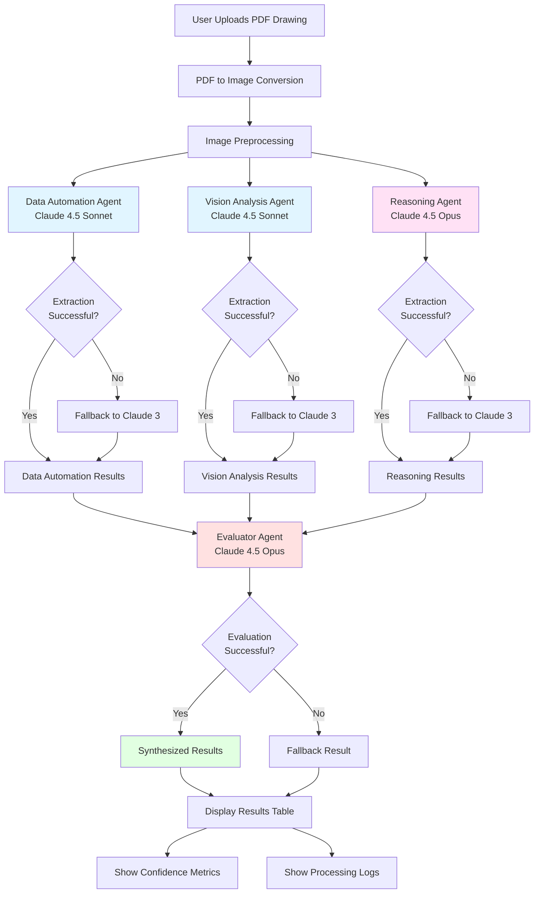

# Strands Multi-Agent Swarm for Engineering Drawing Extraction

A sophisticated multi-agent system using AWS Strands framework to extract dimensions from engineering drawings with high accuracy through collaborative AI agents.

## 📋 Table of Contents

- [Overview](#overview)
- [Architecture](#architecture)
- [Agent Flow Diagram](#agent-flow-diagram)
- [Specialized Agents](#specialized-agents)
- [Prerequisites](#prerequisites)
- [Installation](#installation)
- [Configuration](#configuration)
- [Usage](#usage)
- [Troubleshooting](#troubleshooting)

---

## 🎯 Overview

This system uses a **multi-agent swarm pattern** where specialized AI agents collaborate to extract precise dimensions from engineering drawings. Each agent has a specific role, and a final evaluator agent synthesizes their outputs to produce the most accurate results.

### Key Features

- **Multi-Agent Collaboration**: 4 specialized agents working together
- **High Accuracy**: Cross-validation and consensus-based extraction
- **Fallback Mechanisms**: Multiple Claude models for reliability
- **Detailed Logging**: Complete audit trail of extraction process
- **User-Friendly Interface**: Streamlit-based web application

---

## 🏗️ Architecture

The system follows a **sequential swarm pattern** where agents process the drawing independently, and an evaluator synthesizes their findings.

### System Components

1. **Data Automation Specialist** - Focused extraction using Claude 4.5 Sonnet
2. **Vision Analysis Specialist** - Detailed visual inspection using Claude 4.5 Sonnet
3. **Reasoning Specialist** - Deep analysis and validation using Claude 4.5 Opus
4. **Evaluator Specialist** - Final synthesis and decision-making using Claude 4.5 Opus

---

## 📊 Agent Flow Diagram



### Flow Explanation

1. **Input Stage**: User uploads PDF engineering drawing
2. **Preprocessing**: PDF converted to high-resolution image (300 DPI)
3. **Parallel Agent Execution**: Three specialized agents analyze the drawing independently
4. **Fallback Mechanism**: Each agent has fallback to Claude 3 models if Claude 4.5 fails
5. **Evaluation Stage**: Evaluator agent compares all results and selects most accurate values
6. **Output Stage**: Results displayed with confidence scores and processing logs

---

## 🤖 Specialized Agents

### 1. Data Automation Specialist

**Model**: Claude 4.5 Sonnet (global.anthropic.claude-sonnet-4-5-20250929-v1:0)

**Role**: Focused, systematic extraction of dimensions

**Capabilities**:
- Systematic left-to-right, top-to-bottom scanning
- Precise reading of dimension lines and tolerances
- Identification of diameter symbols (⌀)
- Extraction of part numbers from title blocks

**Strengths**:
- Fast processing
- Consistent extraction methodology
- Good at identifying standard dimension patterns

**Output**: JSON with extracted dimensions and source locations

---

### 2. Vision Analysis Specialist

**Model**: Claude 4.5 Sonnet (global.anthropic.claude-sonnet-4-5-20250929-v1:0)

**Role**: Detailed visual inspection and verification

**Capabilities**:
- Deep visual analysis of drawing features
- Cross-referencing dimensions for consistency
- Identification of complex tolerance notations
- Detection of dimension line relationships

**Strengths**:
- Excellent at visual pattern recognition
- Can identify ambiguous or overlapping dimensions
- Strong at reading handwritten annotations

**Output**: JSON with verified dimensions and confidence indicators

---

### 3. Reasoning Specialist

**Model**: Claude 4.5 Opus (us.anthropic.claude-opus-4-5-20251101-v1:0)

**Role**: Deep reasoning and validation

**Capabilities**:
- Logical validation of dimensional relationships
- Engineering knowledge application
- Calculation of derived dimensions
- Detection of inconsistencies

**Strengths**:
- Advanced reasoning capabilities
- Can infer missing dimensions
- Validates dimensional hierarchy (overall > head > port)
- Checks engineering feasibility

**Output**: JSON with validated dimensions and reasoning explanations

---

### 4. Evaluator Specialist

**Model**: Claude 4.5 Opus (global.anthropic.claude-opus-4-5-20251101-v1:0)

**Role**: Final synthesis and decision-making

**Capabilities**:
- Comparison of all agent outputs
- Conflict resolution between agents
- Confidence scoring
- Selection of most accurate values

**Evaluation Criteria**:
1. **Source Description Quality**: Prefers agents that describe where they found dimensions
2. **Dimensional Logic**: Validates relationships (overall > head > port, head_dia > shaft_dia)
3. **Consistency**: Cross-validates values across agents
4. **Engineering Feasibility**: Rejects unreasonable values

**Decision Process**:
```
For each dimension:
  1. Collect all agent extractions
  2. Check for consensus (2+ agents agree)
  3. If consensus exists → use consensus value
  4. If no consensus → evaluate based on:
     - Source description quality
     - Dimensional logic validation
     - Engineering feasibility
  5. Assign confidence score (0.0-1.0)
  6. Document reasoning
```

**Strengths**:
- Highest accuracy through synthesis
- Robust conflict resolution
- Transparent decision-making
- Confidence quantification

**Output**: Final JSON with best values, confidence scores, and evaluation reasoning

---

## 📦 Prerequisites

### System Requirements

- **Operating System**: Linux, macOS, or Windows
- **Python**: 3.9 or higher
- **Memory**: 4GB RAM minimum (8GB recommended)
- **Disk Space**: 2GB free space

### AWS Requirements

- **AWS Account** with access to:
  - Amazon Bedrock (Claude 4.5 models)
  - AWS Textract (optional, for OCR)
- **AWS Credentials** configured
- **Model Access**: Request access to Claude models in Bedrock console

### Required AWS Permissions

```json
{
  "Version": "2012-10-17",
  "Statement": [
    {
      "Effect": "Allow",
      "Action": [
        "bedrock:InvokeModel"
      ],
      "Resource": [
        "arn:aws:bedrock:*::foundation-model/anthropic.claude-*",
        "arn:aws:bedrock:*::foundation-model/global.anthropic.claude-*",
        "arn:aws:bedrock:*::foundation-model/us.anthropic.claude-*"
      ]
    },
    {
      "Effect": "Allow",
      "Action": [
        "textract:AnalyzeDocument"
      ],
      "Resource": "*"
    }
  ]
}
```

---

## 🚀 Installation

### Step 1: Clone or Download

Download the deployment package to your target machine:

```bash
# Create project directory
mkdir strands-barrel-extractor
cd strands-barrel-extractor

# Copy all files from deployment-package
# - strands_barrel_extractor.py
# - requirements.txt
# - README.md (this file)
```

### Step 2: Create Virtual Environment

```bash
# Create virtual environment
python3 -m venv venv

# Activate virtual environment
# On Linux/macOS:
source venv/bin/activate

# On Windows:
venv\Scripts\activate
```

### Step 3: Install Dependencies

```bash
# Upgrade pip
pip install --upgrade pip

# Install required packages
pip install -r requirements.txt
```

### Step 4: Install System Dependencies

#### For PDF Processing (pdf2image):

**On Ubuntu/Debian:**
```bash
sudo apt-get update
sudo apt-get install -y poppler-utils
```

**On macOS:**
```bash
brew install poppler
```

**On Windows:**
- Download poppler from: https://github.com/oschwartz10612/poppler-windows/releases
- Extract and add `bin` folder to PATH

---

## ⚙️ Configuration

### 1. AWS Credentials Setup

**PLACEHOLDER LOCATION #1**: AWS Credentials

Choose one of the following methods:

#### Option A: AWS CLI Configuration (Recommended)

```bash
aws configure
```

Enter your credentials when prompted:
- AWS Access Key ID: `YOUR_ACCESS_KEY_ID`
- AWS Secret Access Key: `YOUR_SECRET_ACCESS_KEY`
- Default region name: `us-west-2` (or your preferred region)
- Default output format: `json`

#### Option B: Environment Variables

```bash
# On Linux/macOS:
export AWS_ACCESS_KEY_ID="YOUR_ACCESS_KEY_ID"
export AWS_SECRET_ACCESS_KEY="YOUR_SECRET_ACCESS_KEY"
export AWS_DEFAULT_REGION="us-west-2"

# On Windows (PowerShell):
$env:AWS_ACCESS_KEY_ID="YOUR_ACCESS_KEY_ID"
$env:AWS_SECRET_ACCESS_KEY="YOUR_SECRET_ACCESS_KEY"
$env:AWS_DEFAULT_REGION="us-west-2"
```

#### Option C: IAM Role (For EC2/ECS)

If running on AWS infrastructure, attach an IAM role with the required permissions.

### 2. AWS Region Configuration

**PLACEHOLDER LOCATION #2**: AWS Region in Code

Edit `strands_barrel_extractor.py` line 16:

```python
# BEFORE:
os.environ['AWS_REGION'] = 'YOUR_AWS_REGION'

# AFTER (example):
os.environ['AWS_REGION'] = 'us-west-2'
```

**Available Regions for Claude 4.5**:
- `us-west-2` (US West - Oregon)
- `us-east-1` (US East - N. Virginia)
- `eu-west-1` (Europe - Ireland)
- `ap-southeast-1` (Asia Pacific - Singapore)

### 3. Verify AWS Setup

Test your AWS configuration:

```bash
# Test Bedrock access
aws bedrock list-foundation-models --region us-west-2

# Test Textract access (optional)
aws textract help
```

### 4. Request Model Access

1. Go to AWS Bedrock Console
2. Navigate to "Model access"
3. Request access to:
   - Claude 4.5 Sonnet
   - Claude 4.5 Opus
   - Claude 3 Sonnet (fallback)
   - Claude 3 Haiku (fallback)

---

## 🎮 Usage

### Starting the Application

```bash
# Ensure virtual environment is activated
source venv/bin/activate  # Linux/macOS
# OR
venv\Scripts\activate  # Windows

# Run the Streamlit application
streamlit run strands_barrel_extractor.py
```

The application will open in your default browser at `http://localhost:8501`

### Using the Interface

1. **Upload PDF**: Click "Browse files" and select engineering drawing PDF(s)
2. **Start Analysis**: Click "🚀 Start Swarm Analysis" button
3. **View Results**: Results table shows extracted dimensions with:
   - Dimension name
   - Extracted value
   - Tolerance
   - Unit
   - Confidence score
4. **Check Logs**: Expand "📋 Swarm Execution Logs" to see agent reasoning

### Expected Output

```
📊 Swarm Results

Dimension                    Value      Tolerance    Unit    Confidence
─────────────────────────────────────────────────────────────────────────
Part Number                  F002B14802  N/A         N/A     N/A
Overall Barrel Length        88.38       +0.3        mm      85%
Barrel Head Length           28.70       ±0.1        mm      90%
Port to Shoulder Length      7.40        -0.1        mm      88%
Barrel Head Diameter         17.85       -0.1        mm      92%
Barrel Shaft Diameter        11.50       -0.2        mm      90%

Dimensions Found: 5/5
Overall Confidence: 85%
Extraction Method: strands_swarm
```

---

## 🔧 Troubleshooting

### Common Issues

#### 1. AWS Credentials Error

**Error**: `AWS client initialization failed: Unable to locate credentials`

**Solution**:
- Verify AWS credentials are configured (see Configuration section)
- Check environment variables are set correctly
- Ensure IAM role is attached (if on EC2)

#### 2. Model Access Denied

**Error**: `AccessDeniedException: You don't have access to the model`

**Solution**:
- Request model access in Bedrock console
- Wait for approval (usually instant for Claude models)
- Verify your IAM permissions include `bedrock:InvokeModel`

#### 3. PDF Conversion Error

**Error**: `pdf2image.exceptions.PDFInfoNotInstalledError`

**Solution**:
- Install poppler-utils (see Installation Step 4)
- Verify poppler is in PATH: `pdftoppm -v`

#### 4. Low Confidence Scores

**Issue**: Confidence scores below 70%

**Possible Causes**:
- Poor image quality (increase DPI in code)
- Agents disagree on values (check logs for reasoning)
- Complex or non-standard drawing format

**Solutions**:
- Ensure PDF is high quality
- Check if drawing follows standard conventions
- Review agent logs to understand disagreements

#### 5. Slow Performance

**Issue**: Processing takes >2 minutes per drawing

**Causes**:
- Large PDF files
- Network latency to AWS
- Model throttling

**Solutions**:
- Reduce PDF file size
- Use AWS region closest to you
- Check AWS service quotas

### Debug Mode

Enable detailed logging by modifying line 12 in `strands_barrel_extractor.py`:

```python
# Change from INFO to DEBUG
logging.basicConfig(level=logging.DEBUG, ...)
```

### Log Files

- **Application Log**: `strands_extractor.log` (in current directory)
- **Streamlit Log**: Check terminal output

---

## 📝 Advanced Configuration

### Customizing Agent Prompts

Edit the `prompt` variable in `bedrock_vision_tool()` function to customize extraction instructions.

### Adjusting Confidence Thresholds

Modify confidence scores in `convert_to_extraction_result()` method:

```python
confidence=dim_dict.get('confidence', 0.8)  # Default 0.8 (80%)
```

### Adding More Agents

To add additional specialized agents:

1. Create new tool function:
```python
@tool
def new_specialist_tool(image_path: str) -> str:
    # Your implementation
    pass
```

2. Add to swarm setup:
```python
new_agent = Agent(
    name="new_specialist",
    instructions="Your instructions",
    tools=[new_specialist_tool]
)
```

3. Include in extraction flow:
```python
new_result = new_specialist_tool(image_path)
```

---

## 📚 Additional Resources

- **AWS Strands Documentation**: https://docs.aws.amazon.com/strands/
- **Amazon Bedrock**: https://aws.amazon.com/bedrock/
- **Claude Models**: https://www.anthropic.com/claude
- **Streamlit Documentation**: https://docs.streamlit.io/

---

## 🤝 Support

For issues or questions:

1. Check the Troubleshooting section
2. Review log files for error details
3. Verify AWS service status
4. Check AWS Bedrock quotas and limits

---

## 📄 License

This software is provided as-is for internal use.

---

## 🔄 Version History

- **v1.0.0** (2025-12-18): Initial deployment package
  - Multi-agent swarm implementation
  - 4 specialized agents
  - Streamlit web interface
  - Comprehensive logging

---

**Last Updated**: December 18, 2025
